[mermaid で描く - UML とか AWS 構成図とかを描くツール](https://zenn.dev/ibaraki/articles/522797d7f6b4c1#mermaid%E3%81%A7%E6%8F%8F%E3%81%8F)

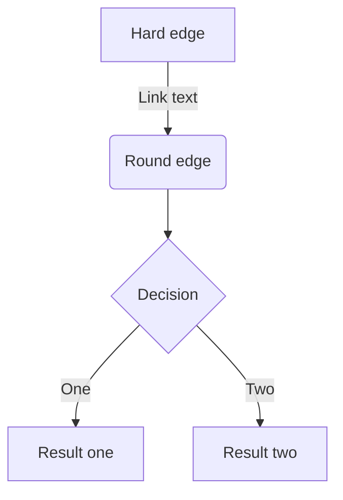

[GitHub で使えるようになった Mermaid の便利なところ](https://zenn.dev/yasuhiroki/articles/dd0feae790ba41)

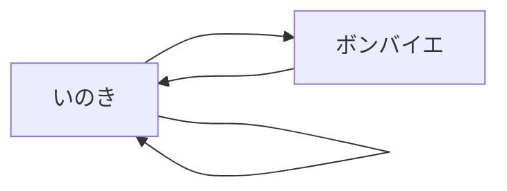

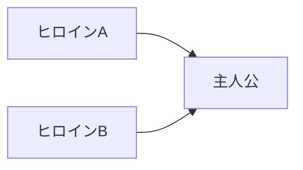

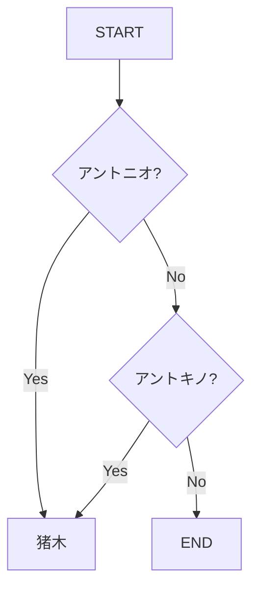

スタートは ●、エンドは ◉ ではないのか？ ← [始点終点にこの 2 記号を使うのは、あくまで State Machine Diagram での話なのかもねぇ](https://mermaid-js.github.io/mermaid/#/flowchart)

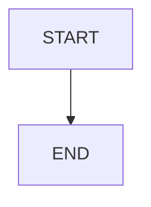

↑ PlantUML だと、 スタートは ●、エンドは ◉ ということになってる。
https://plantuml.com/ja/activity-diagram-beta
IT 専科の説明の方でも。
https://www.itsenka.com/contents/development/uml/activity.html

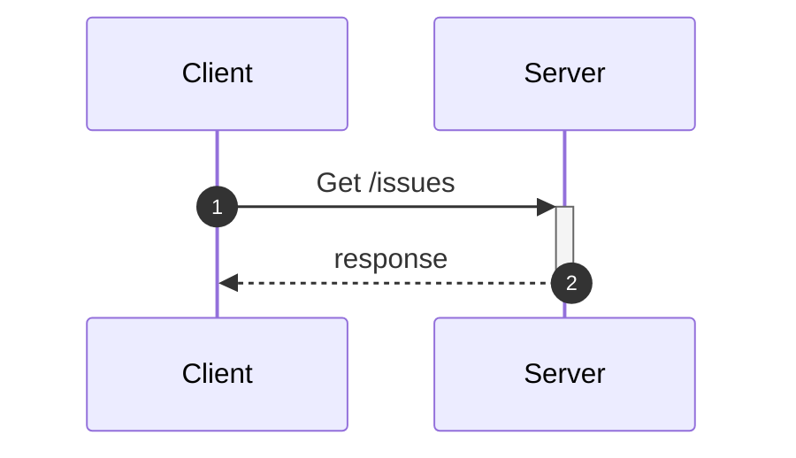

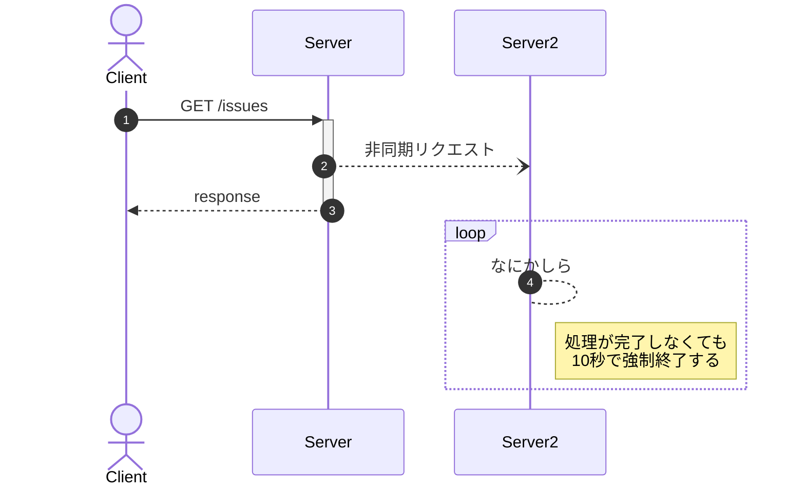

https://mermaid-js.github.io/mermaid/#/flowchart

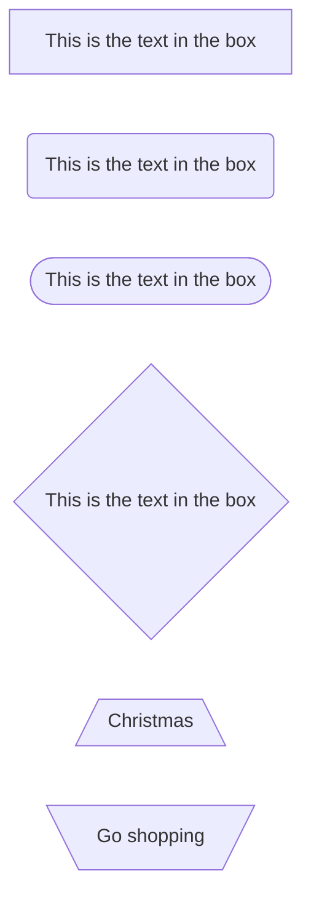

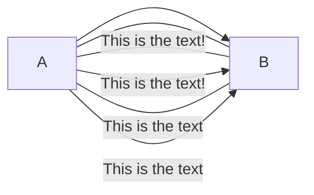

> Each node in the flowchart is ultimately assigned to a rank in the rendered graph, i.e. to a vertical or horizontal level (depending on the flowchart orientation), based on the nodes to which it is linked.

> For dotted or thick links, the characters to add are equals signs or dots

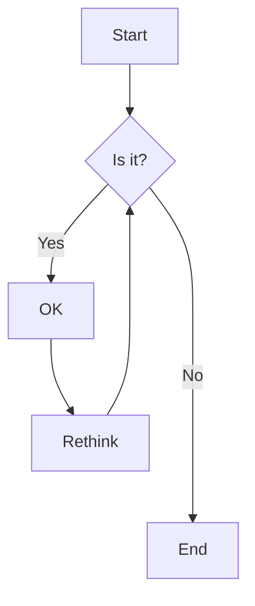

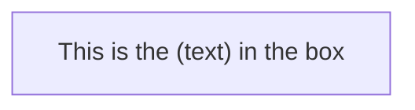

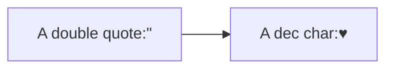

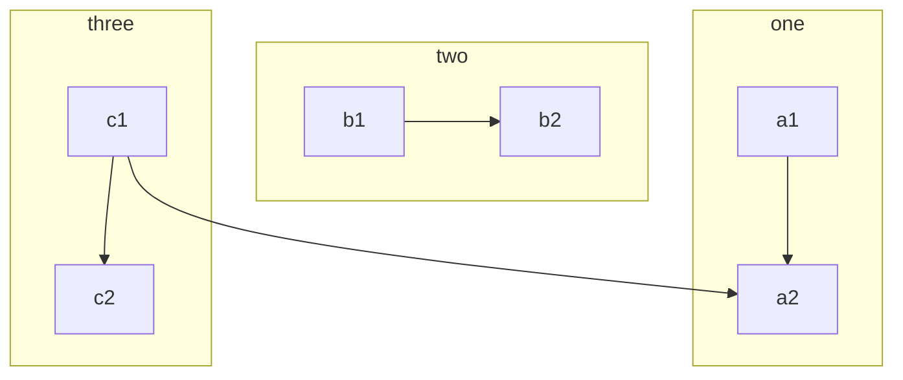

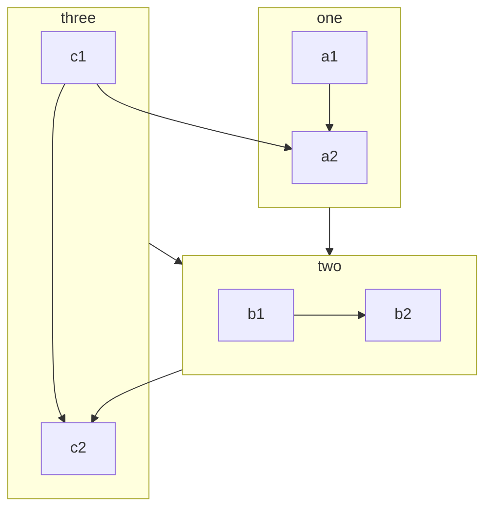

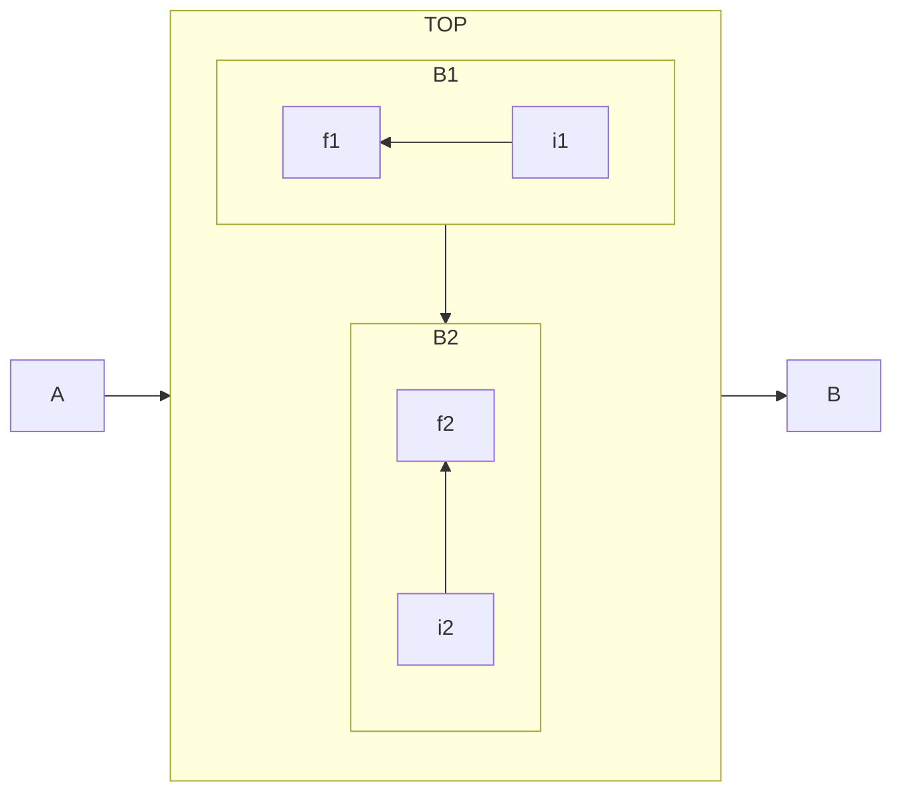

fontawesome は、さすがにサラの状態では使えないか

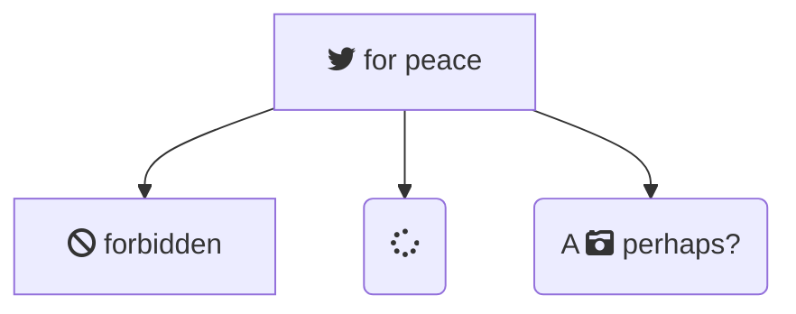

https://mermaid-js.github.io/mermaid/#/sequenceDiagram

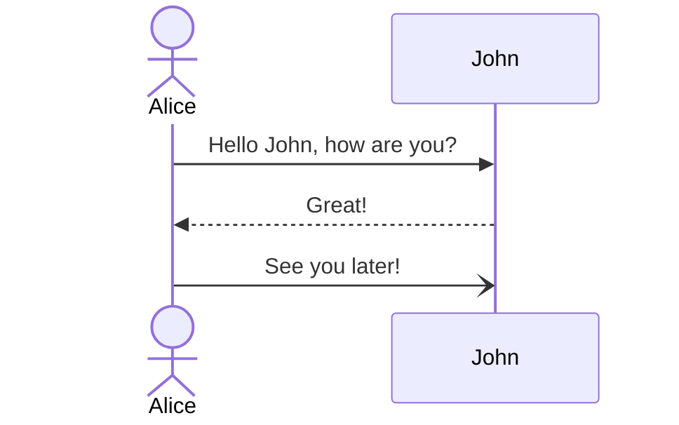

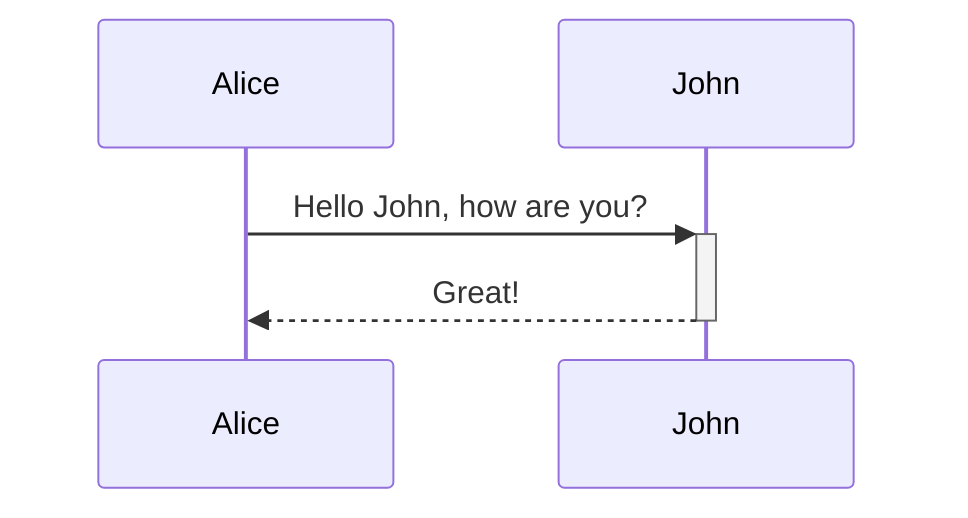

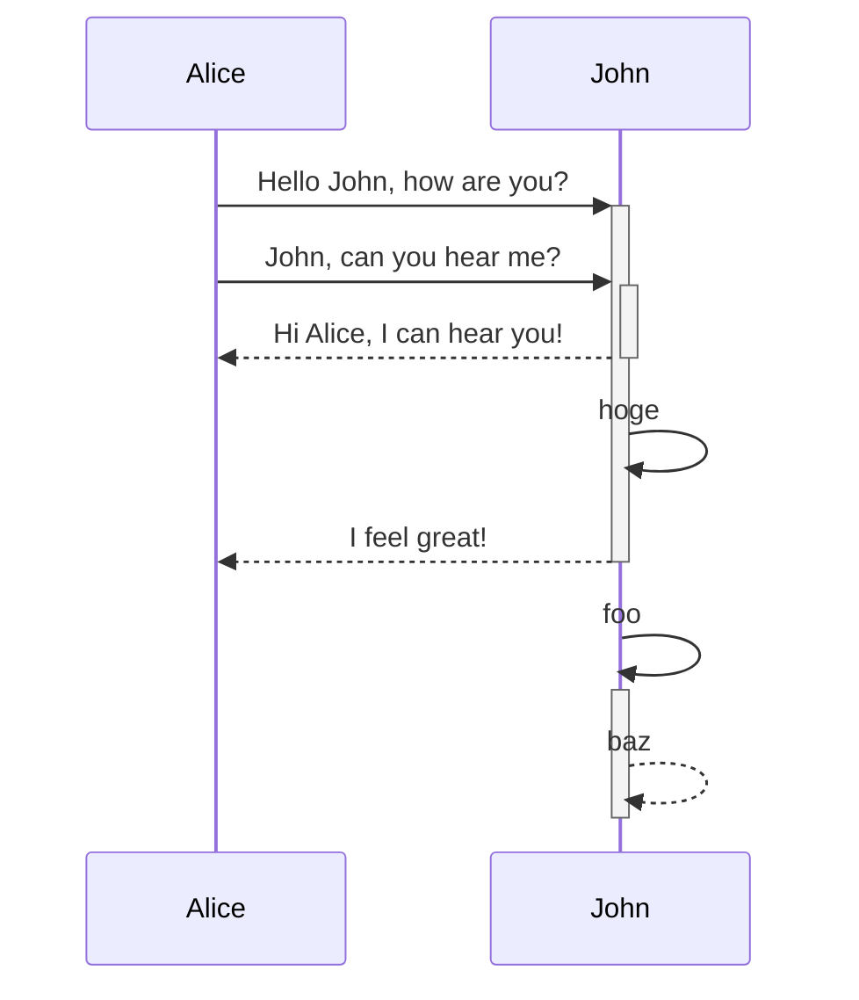

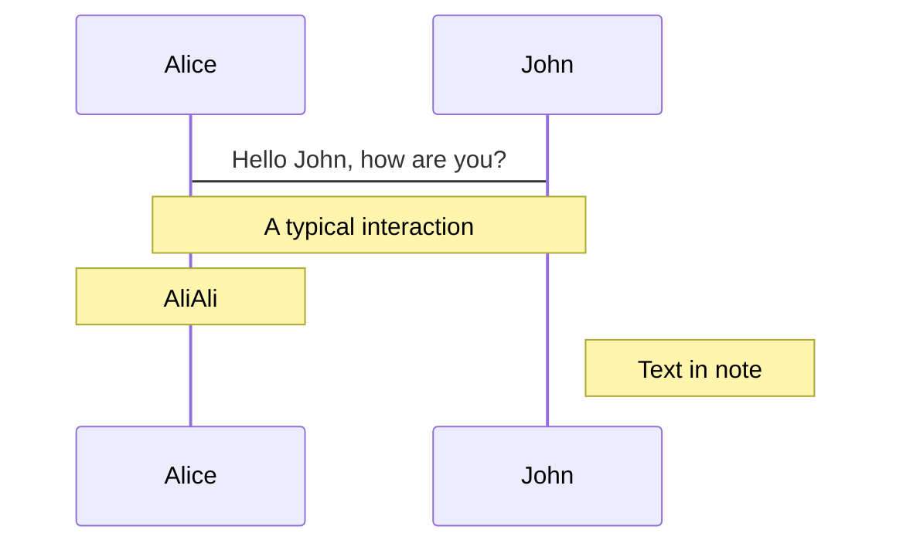

```mermaid
sequenceDiagram
  Alice ->> John: Hello John, how are you?
  loop Every minute
    John -->> Alice: Great!
  end
```

```mermaid
sequenceDiagram
  Alice ->> Bob: Hello Bob, how are you?
  alt is sick
    Bob ->> Alice: Not so good :(
  else is well
    Bob ->> Alice: Feeling fresh like a daisy
  end
  opt Extra response
    Bob ->> Alice: Thanks for asking
  end
```

```mermaid
sequenceDiagram
  Consumer -->> API: Book something
  API -->> BookingService: Start booking process
  break when the booking process fails
    API -->> Consumer: show failure
  end
  API -->> BillingService: Start billing process
```

```mermaid
sequenceDiagram
  participant Alice
  participant John

  rect rgb(50, 250, 255)
    note right of Alice: Alice calls John.
    Alice ->>+ John: Hello Johm, how are you?
    rect rgb(200, 150, 255)
      Alice ->>+ John: John, can you hear me?
      John -->>- Alice: Hi Alice, I can hear you!
    end
    John -->>- Alice: I feel great!
  end

  Alice ->>+ John: Did you want to go to the game tonight?
  John -->>- Alice: Yeah! See you there.
```

```mermaid
sequenceDiagram
  autonumber
  Alice ->> John: Hello John, how are you?
  loop Healthcheck
    John ->> John: Fight against hypochondria
  end
  Note right of John: Rational thoughts!
  John -->> Alice: Great!
  John ->> Bob: How about you?
  Bob -->> John: Jolly good!
```

https://mermaid-js.github.io/mermaid/#/stateDiagram

```mermaid
stateDiagram-v2
  [*] --> Still
  Still --> [*]

  Still --> Moving
  Moving --> Still
  Moving --> Crash
  Crash --> [*]

  state "This is a state description 2" as s2
  s3 : This is a state description 3
  s2 --> s3: A transition
  s3 --> s2: A transition
```

```mermaid
stateDiagram-v2
  [*] --> First
  state First {
    [*] --> second
    second --> [*]
  }
```

```mermaid
stateDiagram-v2
  [*] --> First
  state First {
    [*] --> Second
    state Second {
      [*] --> second
      second --> Third
      state Third {
        [*] --> third
        third --> [*]
      }
    }
  }
```

```mermaid
stateDiagram-v2
  [*] --> First
  First --> Second
  First --> Third

  state First {
    [*] --> fir
    fir --> [*]
  }
  state Second {
    [*] --> sec
    sec --> [*]
  }
  state Third {
    [*] --> thi
    thi --> [*]
  }
```

```mermaid
stateDiagram-v2
  state if_state <<choice>>
  [*] --> IsPositive
  IsPositive --> if_state
  if_state --> False: if n < 0
  if_state --> True: if n >= 0
```

```mermaid
stateDiagram-v2
  direction LR
  State1: The state with a note
  note right of State1
    Important information! You can write notes
  end note
  State1 --> State2
  note left of State2: This is the note to the left.
```

https://mermaid-js.github.io/mermaid/#/entityRelationshipDiagram

```mermaid
erDiagram
  CUSTOMER ||--o{ ORDER : places
  ORDER ||--|{ LINE-ITEM : contains
  CUSTOMER }|..|{ DELIVERY-ADDRESS : uses
```

```mermaid
erDiagram
  CUSTOMER ||--o{ ORDER : places
  CUSTOMER {
    string name
    string custNumber
    string sector
  }
  ORDER ||--|{ LINE-ITEM: contains
  ORDER {
    int orderNumber
    string deliveryAddress
  }
  LINE-ITEM {
    string productCode
    int quantity
    float pricePerUnit
  }
```

https://mermaid-js.github.io/mermaid/#/examples?id=sequence-diagram-blogging-app-service-communication

```mermaid
sequenceDiagram
  participant web as Web Browser
  participant blog as Blog Service
  participant account as Account Service
  participant mail as Mail Service
  participant db as Storage

  Note over web, db: The user must be logged in to submit blog posts

  web ->>+ account: Logs in using credentials
  account ->>+ db: Query stored accounts
  db ->>- account: Respond with query result

  alt Credentials not found
    account ->> web: Invalid credentials
  else Credentials found
    account ->>- web: Successfully logged in

    Note over web, db: When the user is authenticated, they can now submit new posts

    web ->>+ blog: Submit new post
    blog ->> db: Store post data

    par Notifications
      blog --) mail: Send mail to blog subscribers
      blog --) db: Store in-site notifications
    and Response
      blog -->>- web: Successfully posted
    end
  end
```
