[mermaid で描く - UML とか AWS 構成図とかを描くツール](https://zenn.dev/ibaraki/articles/522797d7f6b4c1#mermaid%E3%81%A7%E6%8F%8F%E3%81%8F)

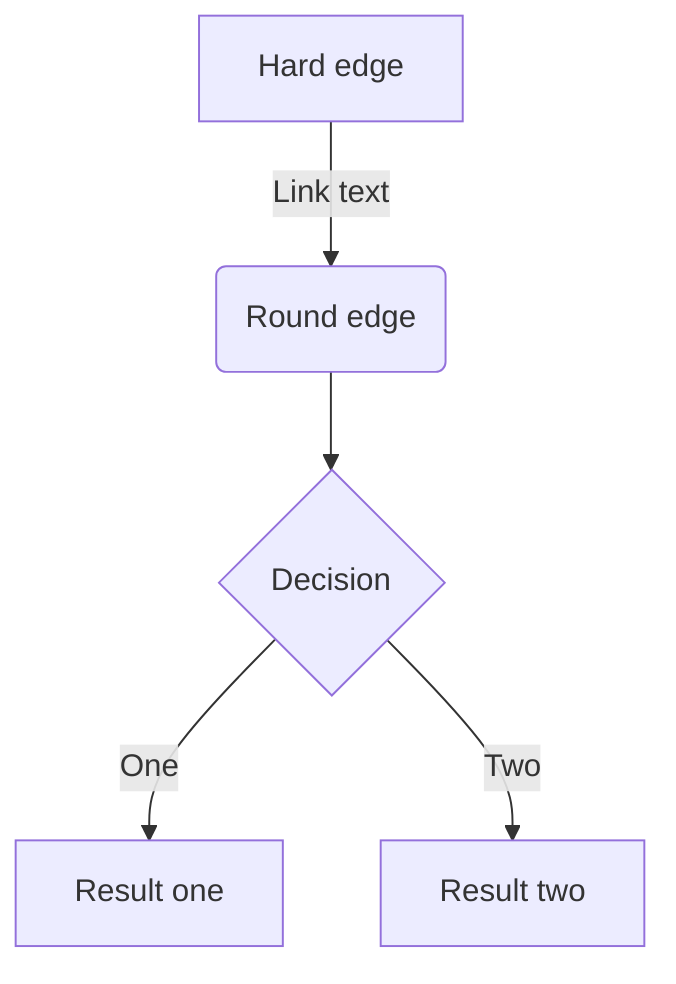

[GitHub で使えるようになった Mermaid の便利なところ](https://zenn.dev/yasuhiroki/articles/dd0feae790ba41)

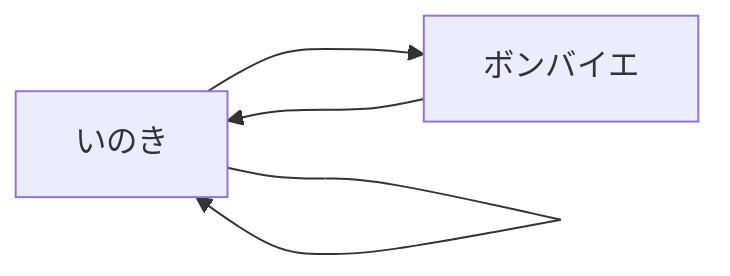

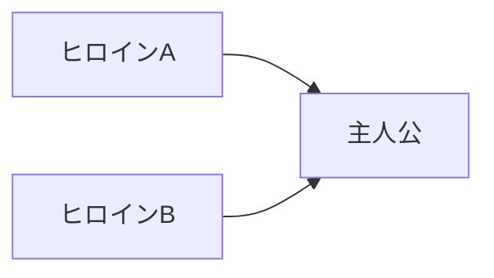

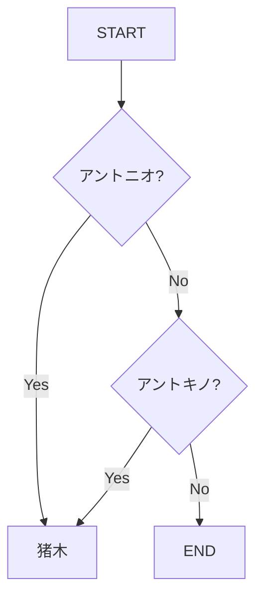

スタートは ●、エンドは ◉ ではないのか？ ← [始点終点にこの 2 記号を使うのは、あくまで State Machine Diagram での話なのかもねぇ](https://mermaid-js.github.io/mermaid/#/flowchart)

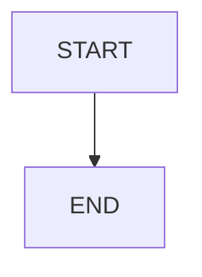

↑ PlantUML だと、 スタートは ●、エンドは ◉ ということになってる。
https://plantuml.com/ja/activity-diagram-beta
IT 専科の説明の方でも。
https://www.itsenka.com/contents/development/uml/activity.html

https://mermaid-js.github.io/mermaid/#/flowchart

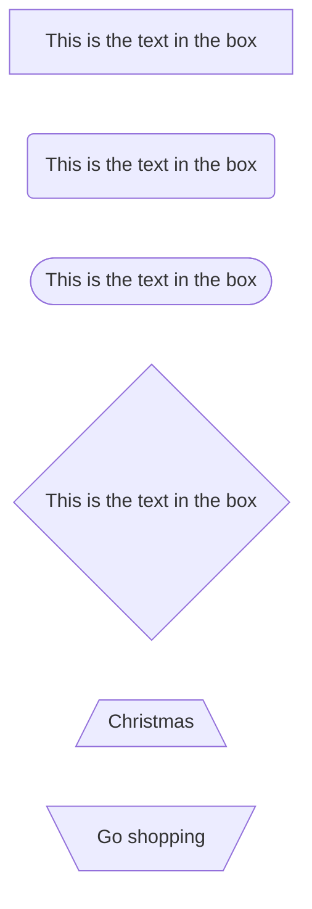

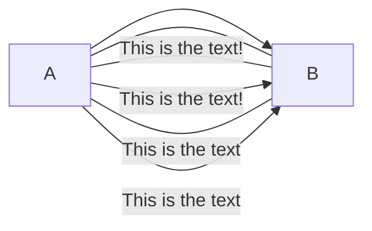

> Each node in the flowchart is ultimately assigned to a rank in the rendered graph, i.e. to a vertical or horizontal level (depending on the flowchart orientation), based on the nodes to which it is linked.

> For dotted or thick links, the characters to add are equals signs or dots

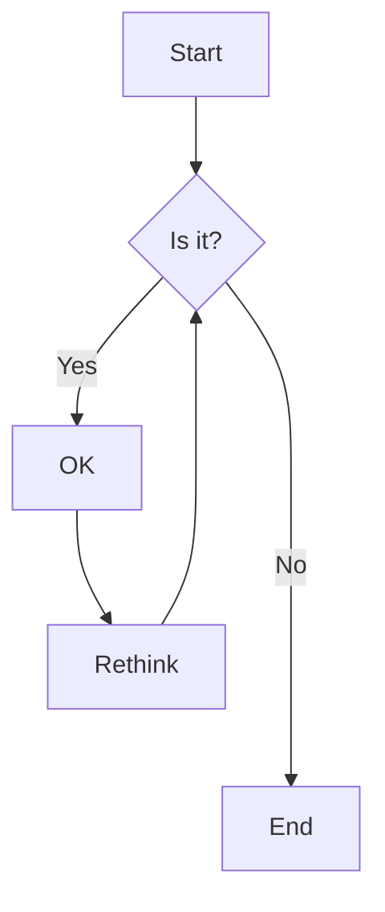

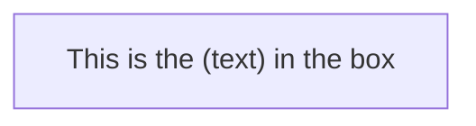

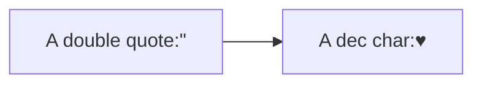

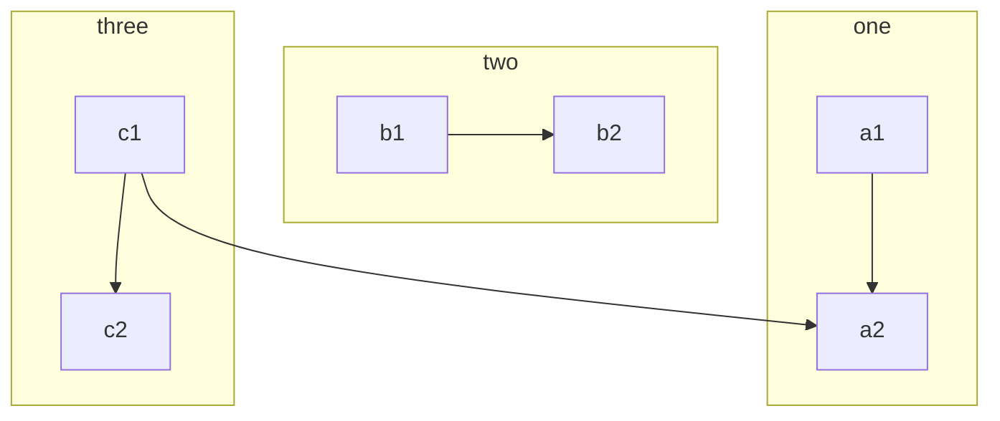

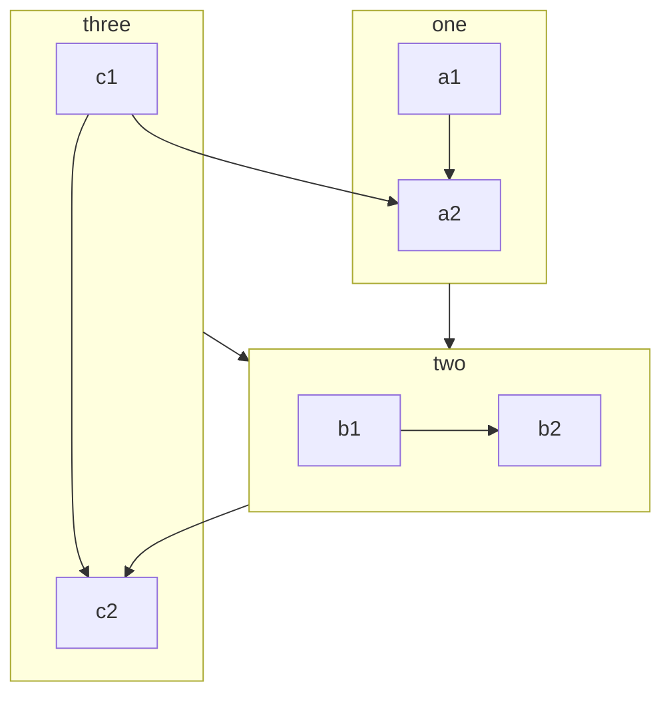

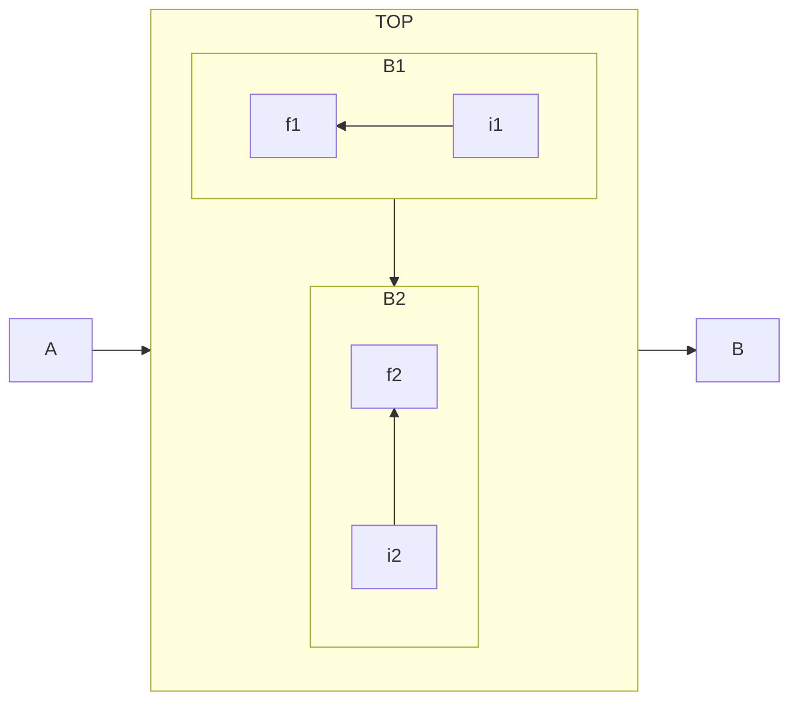

fontawesome は、さすがにサラの状態では使えないか

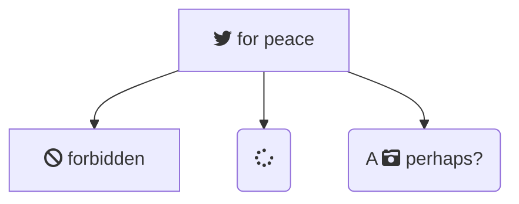
