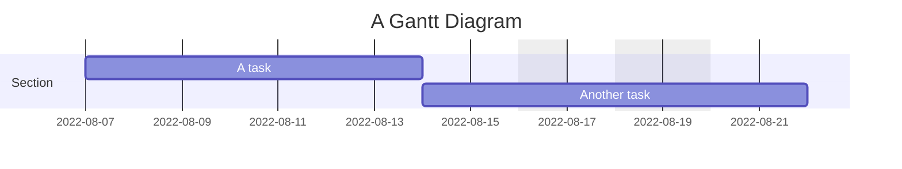
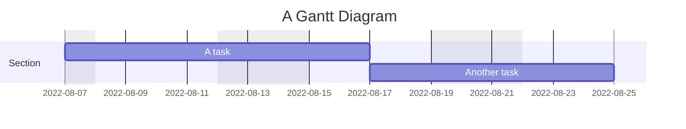
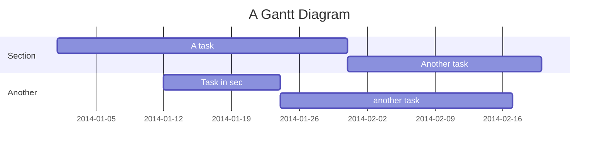
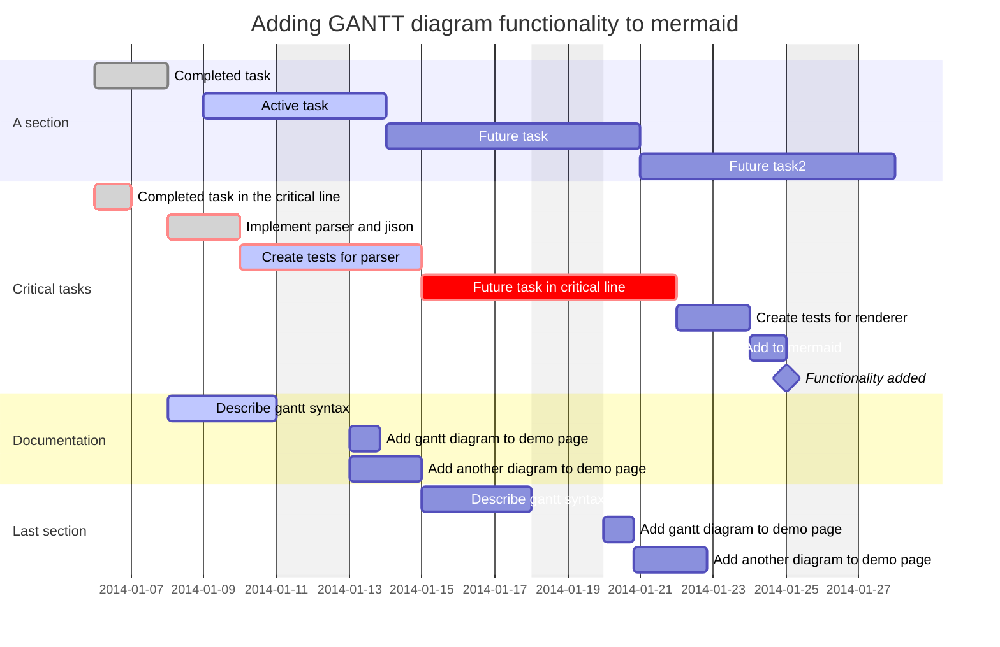
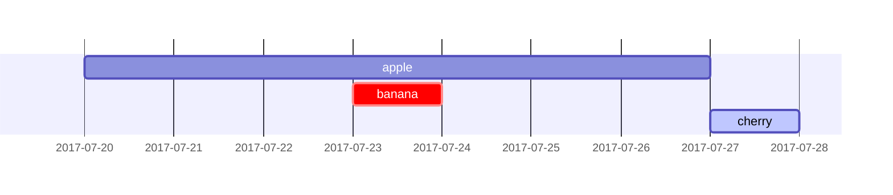

https://mermaid-js.github.io/mermaid/#/gantt

```mermaid
gantt
  title A Gantt Diagram
  dateFormat YYYY-MM-DD
  excludes 2022-08-16, 2022-08-18, 2022-08-19

  section Section

  A task       : a1, 2022-08-07, 7d
  Another task : after a1, 5d
```

```mermaid
gantt
  title A Gantt Diagram
  dateFormat YYYY-MM-DD
  excludes Sunday, Friday, Saturday

  section Section

  A task       : a1, 2022-08-07, 7d
  Another task : after a1, 5d
```

```mermaid
gantt
  dateFormat YYYY-MM-DD

  title A Gantt Diagram

  section Section
  A task       : a1, 2014-01-01, 30d
  Another task : after a1, 20d

  section Another
  Task in sec  : 2014-01-12, 12d
  another task : 24d
```

```mermaid
gantt
  dateFormat  YYYY-MM-DD
  title       Adding GANTT diagram functionality to mermaid
  excludes    weekends
  %% (`excludes` accepts specific dates in YYYY-MM-DD format, days of the week ("sunday") or "weekends", but not the word "weekdays".)

  section A section
  Completed task : done,   des1, 2014-01-06, 2014-01-08
  Active task    : active, des2, 2014-01-09, 3d
  Future task    :         des3, after des2, 5d
  %% Future task2    :         des3, after des2, 5d
  Future task2   :         des4, after des3, 5d

  section Critical tasks
  Completed task in the critical line : crit, done, 2014-01-06, 24h
  Implement parser and jison          : crit, done, after des1, 2d
  Create tests for parser             : crit, active, 3d
  Future task in critical line        : crit, 5d
  Create tests for renderer           : 2d
  Add to mermaid                      : 1d
  Functionality added                 : milestone, 2014-01-25, 0d
  %% Functionality added                 : milestone, 2014-01-25, 1d

  section Documentation
  Describe gantt syntax               : active, a1, after des1, 3d
  Add gantt diagram to demo page      : after a1, 20h
  Add another diagram to demo page    : doc1, after a1, 48h

  section Last section
  Describe gantt syntax               : after doc1, 3d
  Add gantt diagram to demo page      : 20h
  Add another diagram to demo page    : 48h
```

```mermaid
  gantt
    apple  : a, 2017-07-20, 1w
    banana : crit, b 2017-07-23, 1d
    cherry : active, c, after b a, 1d
```

```mermaid
  gantt
    dateFormat HH:mm
    axisFormat %H:%M

    Initial milestone : milestone, m1, 17:49, 2min
    taska2            : 10min
    taska3            : 5min
    Final milestone   : milestone, m2, 18:14, 2min
```
