[GitHub で使えるようになった Mermaid の便利なところ](https://zenn.dev/yasuhiroki/articles/dd0feae790ba41)

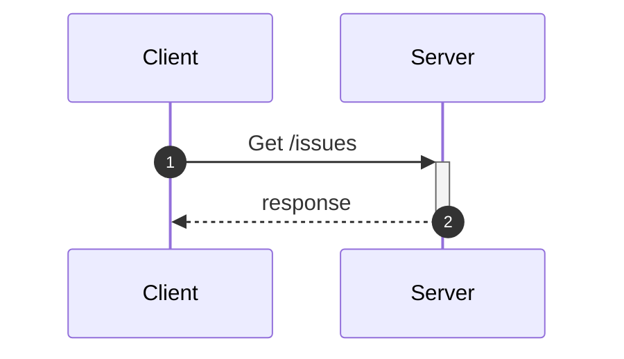

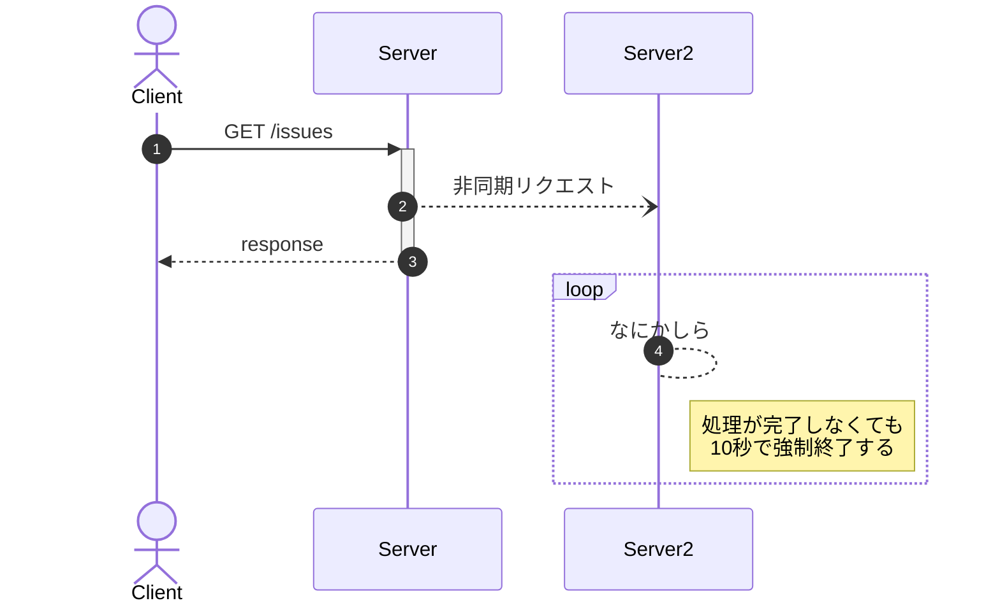

https://mermaid-js.github.io/mermaid/#/sequenceDiagram

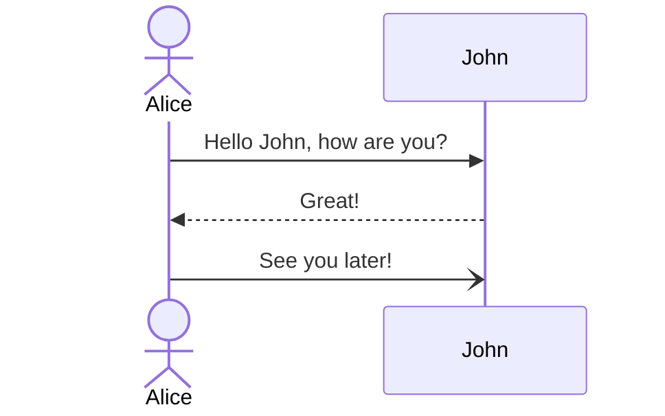

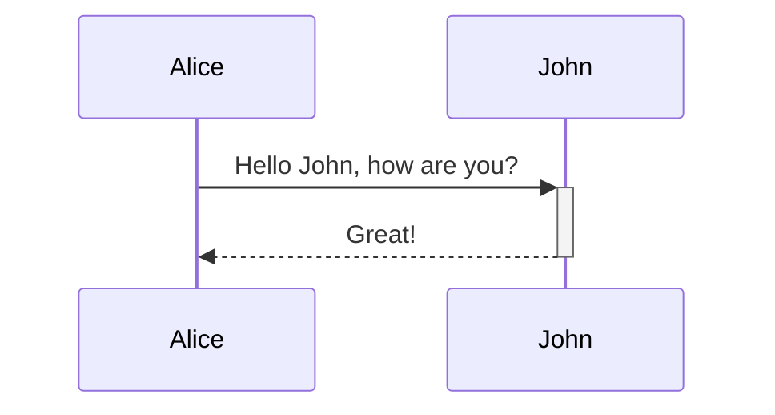

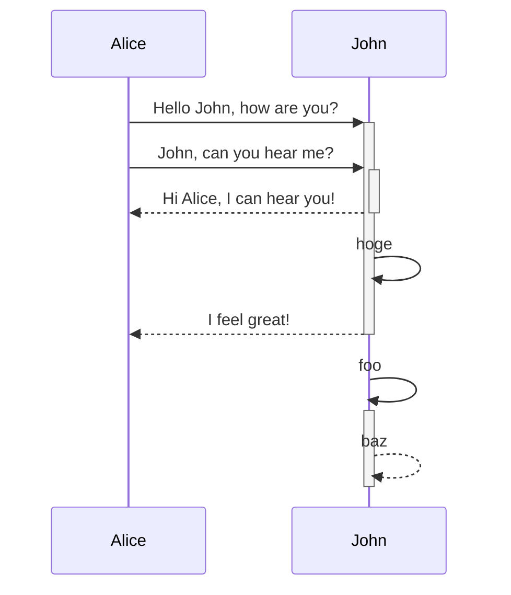

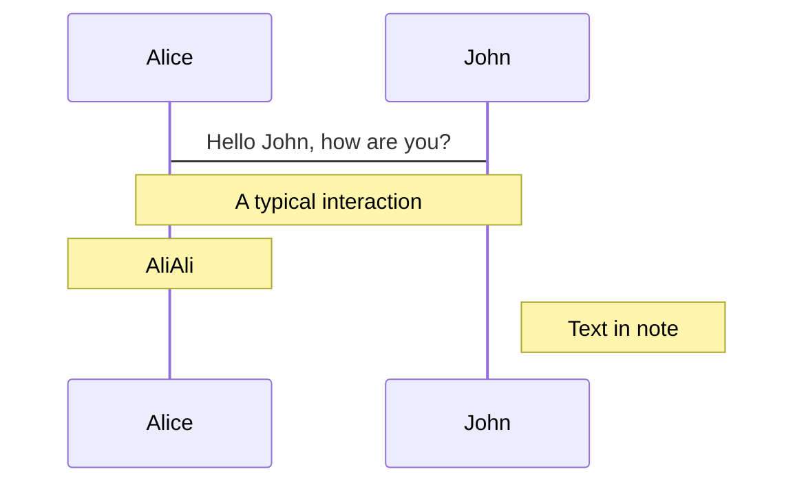

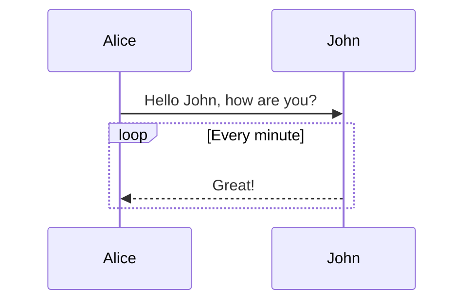

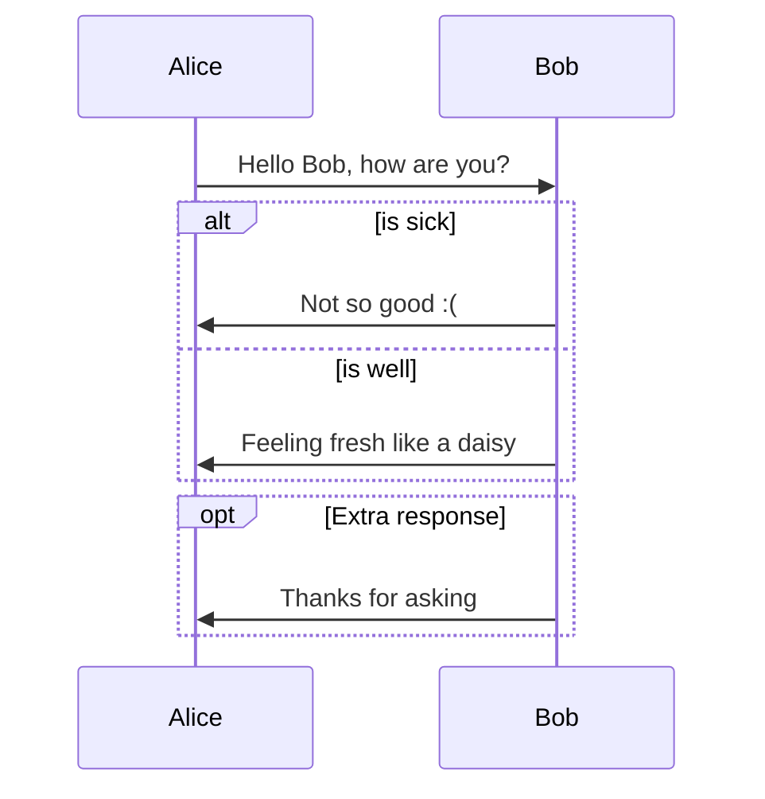

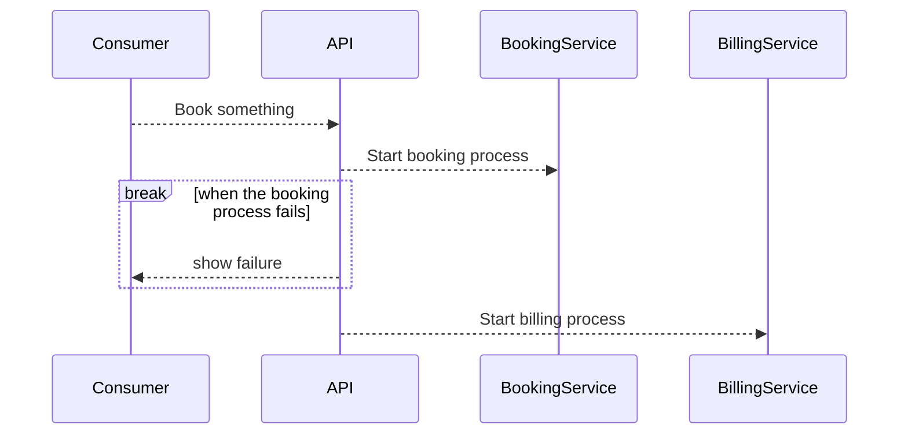

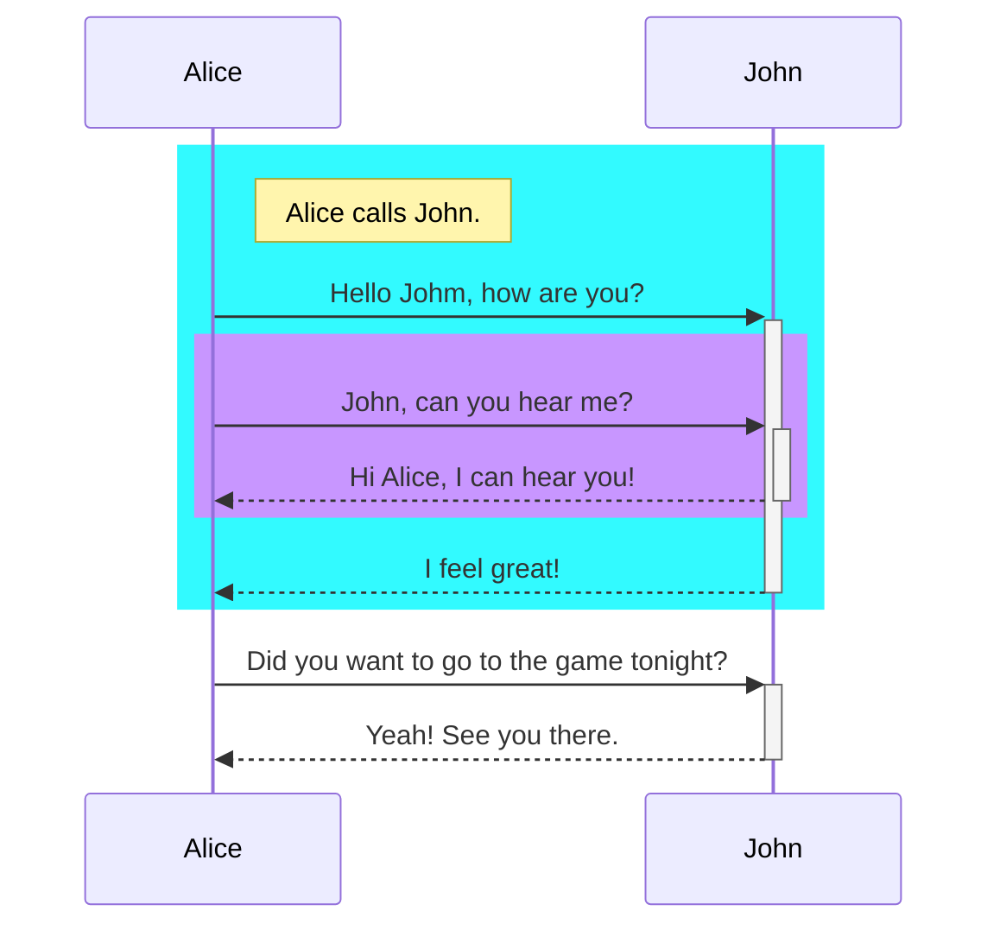

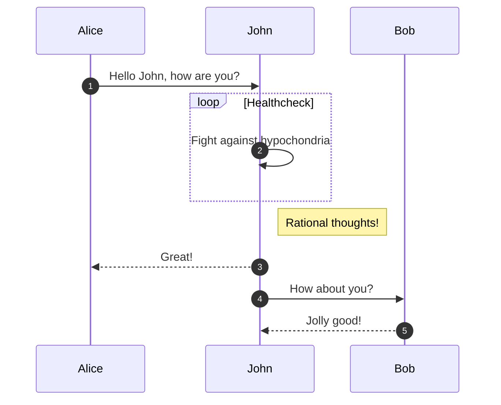

https://mermaid-js.github.io/mermaid/#/examples?id=sequence-diagram-blogging-app-service-communication

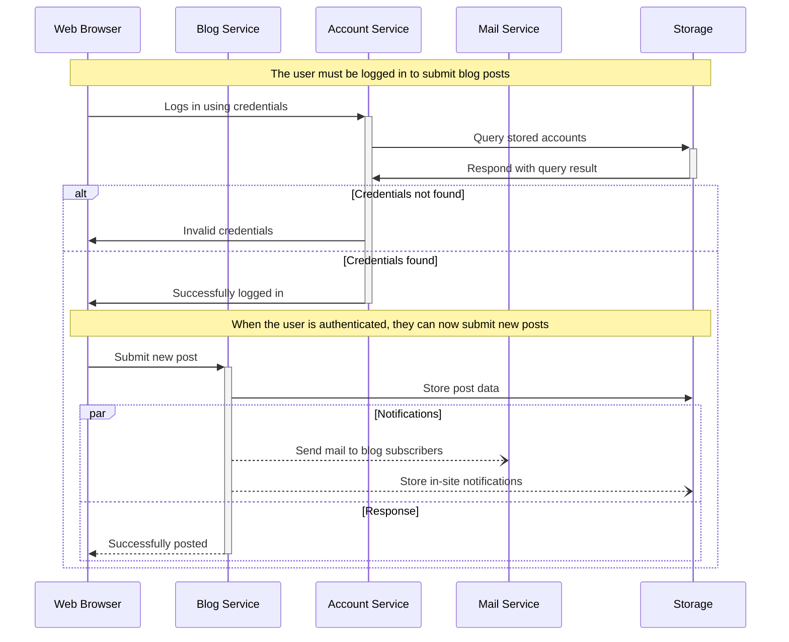
