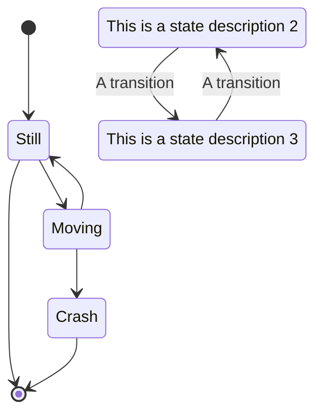
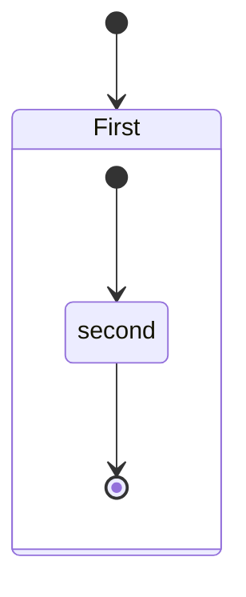
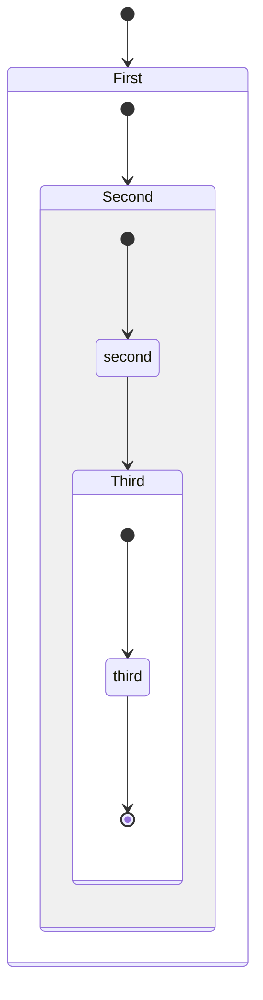
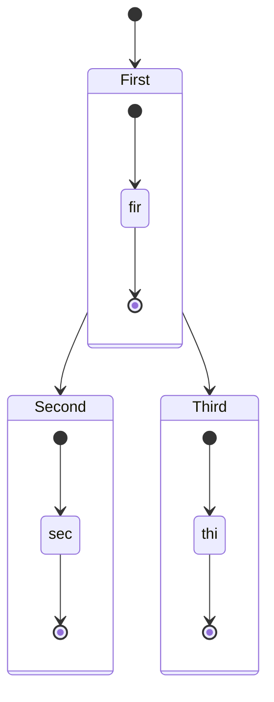
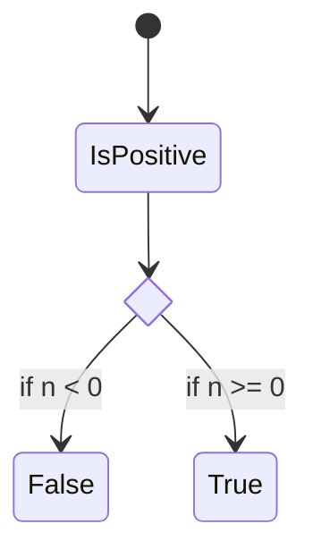
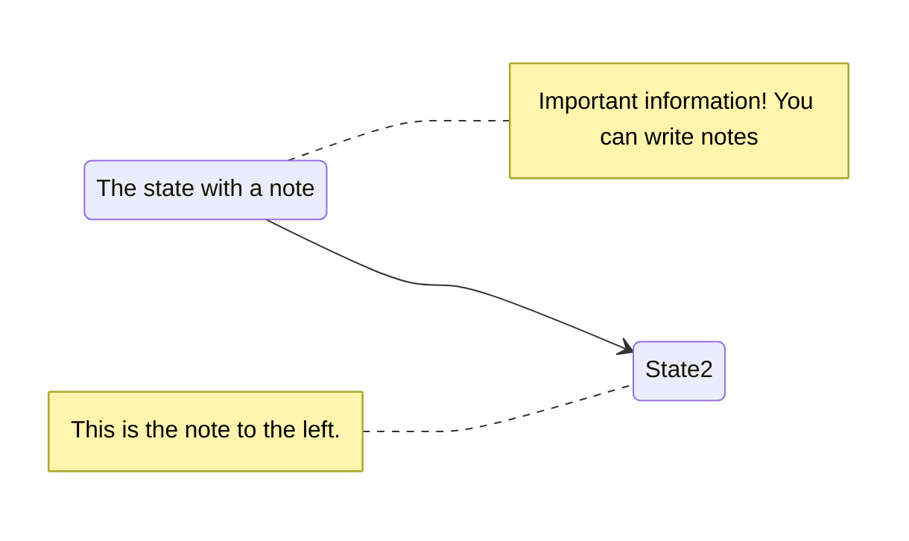

https://mermaid-js.github.io/mermaid/#/stateDiagram

```mermaid
stateDiagram-v2
  [*] --> Still
  Still --> [*]

  Still --> Moving
  Moving --> Still
  Moving --> Crash
  Crash --> [*]

  state "This is a state description 2" as s2
  s3 : This is a state description 3
  s2 --> s3: A transition
  s3 --> s2: A transition
```

```mermaid
stateDiagram-v2
  [*] --> First
  state First {
    [*] --> second
    second --> [*]
  }
```

```mermaid
stateDiagram-v2
  [*] --> First
  state First {
    [*] --> Second
    state Second {
      [*] --> second
      second --> Third
      state Third {
        [*] --> third
        third --> [*]
      }
    }
  }
```

```mermaid
stateDiagram-v2
  [*] --> First
  First --> Second
  First --> Third

  state First {
    [*] --> fir
    fir --> [*]
  }
  state Second {
    [*] --> sec
    sec --> [*]
  }
  state Third {
    [*] --> thi
    thi --> [*]
  }
```

```mermaid
stateDiagram-v2
  state if_state <<choice>>
  [*] --> IsPositive
  IsPositive --> if_state
  if_state --> False: if n < 0
  if_state --> True: if n >= 0
```

```mermaid
stateDiagram-v2
  direction LR
  State1: The state with a note
  note right of State1
    Important information! You can write notes
  end note
  State1 --> State2
  note left of State2: This is the note to the left.
```
